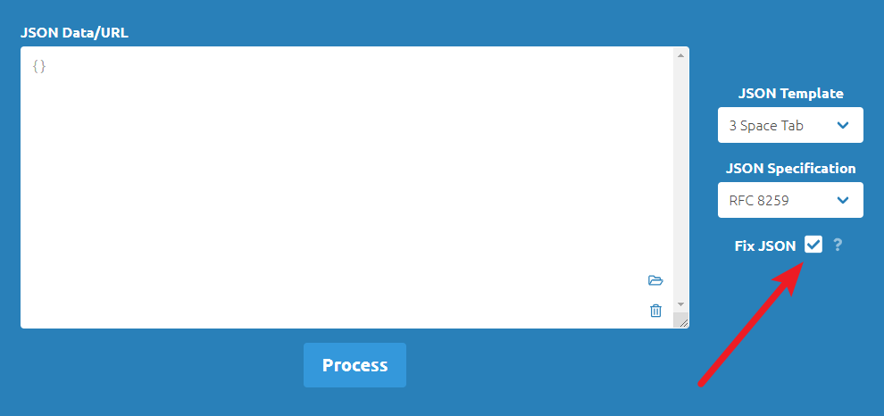
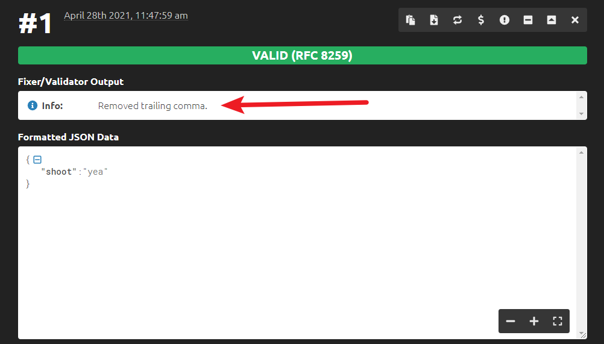
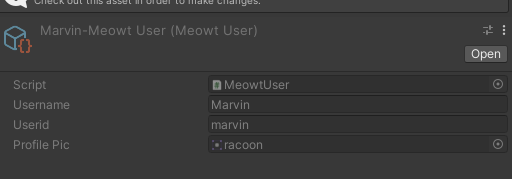
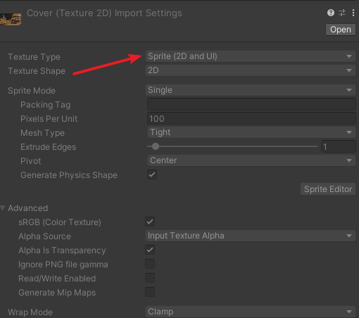
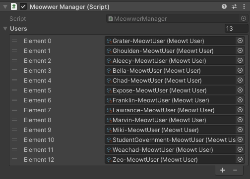

# Meowwer System
## 0. Table of Contents

- [Meowwer System](#meowwer-system)
  * [0. Table of Contents](#0-table-of-contents)
  * [1. Strucutre of a Meowt Bundle File](#1-strucutre-of-a-meowt-bundle-file)
    + [1.1. What the Hell Am I Looking at?](#11-what-the-hell-am-i-looking-at-)
    + [1.2. Verifying the JSON](#12-verifying-the-json)
  * [2. Adding a Meowt User](#2-adding-a-meowt-user)

<small><i><a href='http://ecotrust-canada.github.io/markdown-toc/'>Table of contents generated with markdown-toc</a></i></small>


## 1. Strucutre of a Meowt Bundle File
A Meowt bundle can often contain multiple Meowts, or just one. These bundles are kept in a JSON file.

```
{
   "meowts":[
      {
         "user":"SG",
         "content":"Happy Birthday, My Dearest Cat Butter!",
		 "url":"HappyBirthday/SearchResult",
		 "uniquePostID":"alice-post",
         "replies":[
            {
               "user":"bella",
               "content":"happy birthday ya cute lil thing!"
            }
         ]
      }
   ]
}
```

### 1.1. What the Hell Am I Looking at?

To understand how this works, lets look at the Meowt C# class in the project.
```
public class Meowt : ISerializationCallbackReceiver
{
	public string user;
	public string content;
	public string url;
	public List<Meowt> replies;
	public string uniquePostID = "";
	//....
```

As you can (or maybe you couldn't) see, the fields in the meowt json just corresponds to these fields.

 - user: This is the user id of the [Meowt User](#2-adding-a-meowt-user). When a corresponding user couldn't be found, its name will be defaulted to "Anonymouse".
 - content: What the user says.
 - url(Optional): it actually is not the url, but path to the [webpage's SearchResult.txt](readme_search_system.md#23-searchresulttxt). When a url is provided, the link will be displayed in the Meowwer feed. If this is not provided, it will only show the text content of the Meowwer.
 - uniquePostID(Optional): When provided, the [meta value](readme_dialogue_system.md#51-all-meta-values) `#phone_postview_uniqueid` will be set to this value. Otherwise, defaults to empty string.
  - replies: an [json array](https://www.w3schools.com/js/js_json_arrays.asp) of meowts. The meowts are the same structure as this one. You can leave it empty if no replies are available.

Now, lets look back at the example:
```
{
   "meowts":[
      {
         "user":"SG",
         "content":"Happy Birthday, My Dearest Cat Butter!",
		 "url":"HappyBirthday/SearchResult",
		 "uniquePostID":"alice-post",
         "replies":[
            {
               "user":"bella",
               "content":"happy birthday ya cute lil thing!"
            },
			{
			   "user":"malice",
               "content":"aww shes so cute!"
			}
         ]
      }
   ]
}
```
The outer layer `"meowts":[...]` is a wrapper to tell the system that there could be multiple Meowts. You should always start with this.

In the inner layer, each Meowt object is in the format of this:

```
{
	"user":"...",
	"content":"...",
	"url":"...",
	"uniquePostID":"...",
	"replies":[...More Meowts in this Format, in an Array]
}
```

### 1.2. Verifying the JSON
JSONs are so sensitive. They can't allow a signle bit of error, or it wouldn't load.
To deal with this problem, always, verify your json.

[Here's a tool that you can use.](https://jsonformatter.curiousconcept.com/#)

<span style="color:#ff0000">The webpage has changed a lot and now it's very unintuitive to use, so here's something to keep in mind:</span>

When you are only validating, uncheck "Fix JSON". If you don't do so, when you have a JSON that's missing a few comma or having a few extra comma, the page will fix it for you, and claim that the file is valid.

While in reality, the page is claiming that the fixed version is valid - the original file could still be wrong.







## 2. Adding a Meowt User
To add in a new Meowt User, go to the project directory and right click. Choose "Create > MeowtUser" and you will be able to create a new user.



 - Username: The display name of the user.
 - Userid: The user id that starts with a "@" mark, like the one you see on twitter.
 - Profile Pic: A profile image. The Texture Type of the image should be in Sprite



Once you created a meowt user, assign it to the MeowtManager in the scene. It should be under SmartphoneManager by default.



