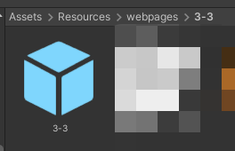
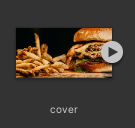
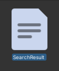

# Web System
## 0. Table of Contents

## 1. Strucutre of a Search Index File
Similar to the dialogue files, the search system file needs to be placed inside the `Resources` folder.
The structure also works similar to the dialogue files.

Here's an example file - we'll go over the details:
```
@cat images
good-cat-images
sad-cat-2
cat-meme
#2
startled-cat

@dog images
dog-images
```

### 1.1. Keyword Marker
First, take a look at the lines start with an `@` mark. This indicates that this line is a keyword line. Anything after this line and before the next `@` mark will be added to the search results. 

Keywords can be separated with a space. In the case of `@cat images`, it means that both `cat` and `images` can lead to the same search results.

### 1.2. Indexing Files
Lets assume that you have a webpage file - though we'll go over how to add in a webpage in [Section 2](2-adding-a-webpage). 

Simply put, add in the filename of the webpage files under the keyword marker.

```
@cat images
good-cat-images
sad-cat-2
cat-meme
startled-cat
```

In this example, the webpage `good-cat-images`, `sad-cat-2`, `cat-meme` and `startled-cat` are added to the search results. You'll be able to search them - provided that the file exists.

### 1.3. Matches Marker
Anything starts with a `#` and a number after it is a matches marker. For example, `#2` means that the player must at least search 2 keywords before the results can show up.

It will apply to any search results after the line and before the next `@` or `#` mark.

### 1.4. Loading an Index File
Simply call the sequence function `/IndexSearch [Path to Index]`
Or, do it the hard way and call the function `SearchManager.Instance.LoadIndex(path)`

The function by default replaces all existing search indexes, instead of appending to them.


## 2. Adding a Webpage
All webpages resides in the directory `Resources/webpages/`. To create a new webpage, first create a new folder under `Resources/webpages/`. The name of the folder will be the name you put in the index file.


In the folder, you'll need a few files to populate it. The ones that are marked in red are the ones that you should worry primarily about.

### 2.1. Webpage Prefab


The prefab should have the same as it's folder's name. In this example, both are `3-3`. When a webpage is loaded, this prefab will be displayed.

When you put them in the search index, write `3-3` is sufficient enough for the web system to locate it.

```
@fast food
3-3
```

### 2.2. Cover Image


This is the cover image that will be displayed on Meowwer. It should only be named `cover`. Any other name can't be located.

Click on the image. In the inspector (hopefully on the right of the screen,) make sure Texture Type is set to "Sprite (2D and UI)". Otherwise, the image will not load.


### 2.3. SearchResult.txt


This is the core file that will make sure everything is displayed correctly in the web system. It should only be called `SearchResult` or the system will fail to lcoate it.

Here's some of the content that you will see in a typical SearchResult.txt. Simply copy and edit the template and everything should work fine.

```
Url: https://www.health.expose.edu/topics/fried-foods
Load-Format: 
Title: Fried foods linked to earlier death.
Description: Fried foods are crunchy, crispy, and tasty, but as tempting as they are, eating them too often might shave years off your life.
PFBName: 1-2
ShowHeader: true
UniqueID: harvard-research
```

 - Url: This is the url that will be displayed when the player sees it on Meowgle or Meowwer.
 - Load-Format: Not used currently. Remove or ignore should be fine. This is just kept here to clear the confusion.
 - Title: The webpage title that will be displayed when the player sees it on Meowgle or Meowwer.
 - Description: A trimmed version of the first paragraph. This will be displayed when the player search on Meowgle, but never shown on Meowwer.
 - PFBName(Optional): Name of the prefab. Keep it the same as the folder's name.
 - ShowHeader: When set to true, this file will display the header with the "Share" button. If not included in the file, defaults to false.
 - UniqueID(Optional): When a player opens this page, the [meta value](readme_dialogue_system.md#51-all-meta-values) `#browser_webpage_uid` will be set to this string. If not included in the file, defaults to the empty string literal.


