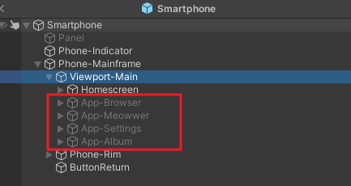
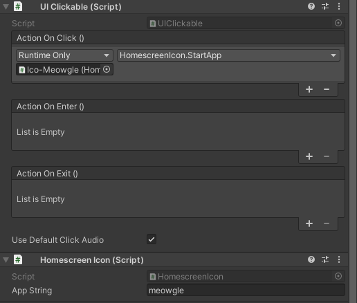

# Web System
## 0. Table of Contents

## 1. Creating a New App
All apps are stored inside the Smartphone prefab, under the main viewport.
`Smartphone > Phone-Mainframe > Viewport-Main`

### 1.1. Creating a Base App

The best way to create a new app is to copy and paste an existing app, and edit it to make it a different one.
But first, you need to understand how each apps' setup is.

Try click into `App-Album`. In the [inspector](https://docs.unity3d.com/Manual/UsingTheInspector.html) on the right, under App, you can probably see something like this:

 - App ID: This is a unique string that will be used to identify which app this is. This will also be the [meta value](readme_dialogue_system.md#51-all-meta-values) assigned to `#phone_app_opened`
 - App Views: Each app will have multiple views. By default, the first view in this list is launched when you start an app.
  - View ID: This is a unique view id to identify the app, such that you can launch them in code. The value will also be assigned to the [meta value](readme_dialogue_system.md#51-all-meta-values) `#phone_view_opened`
  - View Object: This is the corresponding AppView object - we'll go over AppView in the next chapter.

Copy and paste the Album app. Rename the App's `AppID` to something else of your wish. Once you are done with that, click on the Smartphone prefab's base.

In the inspector on the right, under `Installed Apps`, assign in the new app you just created. You still won't be able to launch it just yet, but if you assigned it, then the app is inside the smartphone's registry.

### 1.2. Launching the App You Created in Homescreen
First, expand Homescreen in the smartphone. As you can see, the Homescreen comes with multiple icons and decorations.

If you click into one of the existing apps, like Meowwer or Meowgle, the inspector shows a structure similar to this.

 - UI Clickable: This is a general purpose object that allows you to define what to do when the icon is clicked.
  - Action On Click(): Pay attention to this one. Assign this icon itself to this object's action, and choose HomescreenIcon.StartApp as the action when this is clicked.
  - Action On Enter / Exit: Left empty will do. This is triggered when mouse enters the object and hovers on it, or when the mouse move out of range of this object.

 - Homescreen Icon: This is the icon object that allows you to click into.
  - App String: This is the string you assigned to your base app.

## 3. Appendix
### 3.1. How am I Suppose to Assign the Object to Action On Click?

