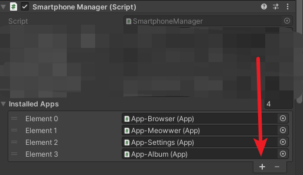
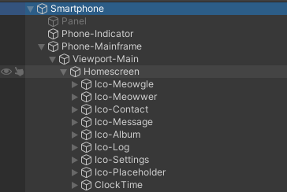
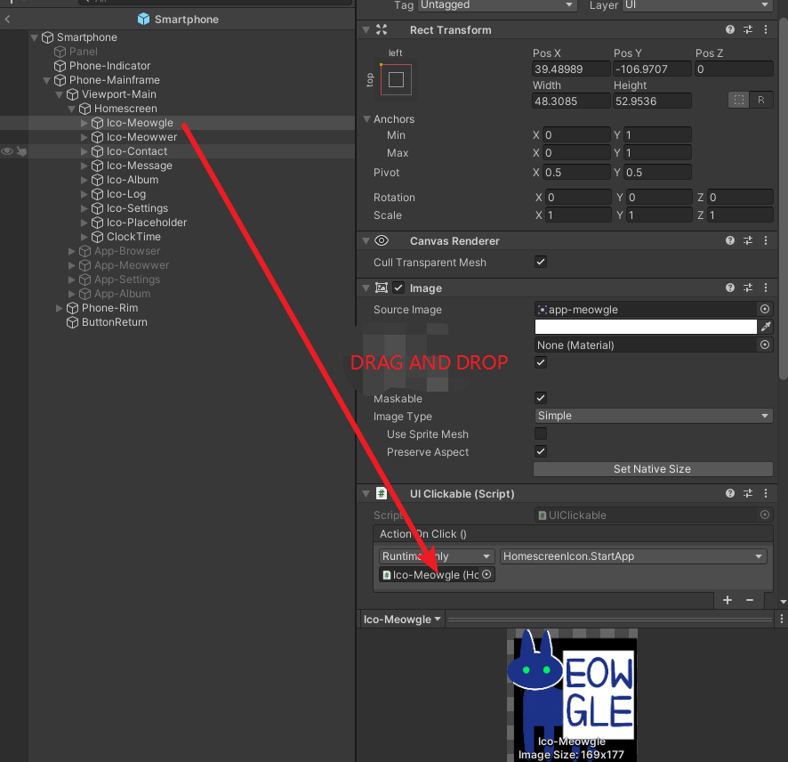

# Web System
## 0. Table of Contents
- [Web System](#web-system)
  * [0. Table of Contents](#0-table-of-contents)
  * [1. Creating a New App](#1-creating-a-new-app)
    + [1.1. Creating a Base App](#11-creating-a-base-app)
    + [1.2. Launching the App You Created in Homescreen](#12-launching-the-app-you-created-in-homescreen)
    + [1.3. Creating an App View (Programming Required)](#13-creating-an-app-view--programming-required-)
      - [1.3.1. AppView](#131-appview)
      - [1.3.2. ViewData](#132-viewdata)
      - [1.3.3. Assigning the View](#133-assigning-the-view)
  * [2. Starting Another View](#2-starting-another-view)
    + [2.1. Starting a View in the Same App](#21-starting-a-view-in-the-same-app)
    + [2.2. Starting a View in Another App](#22-starting-a-view-in-another-app)
  * [3. Appendix](#3-appendix)
    + [3.1. Assign the Object to Action On Click?](#31-assign-the-object-to-action-on-click-)

<small><i><a href='http://ecotrust-canada.github.io/markdown-toc/'>Table of contents generated with markdown-toc</a></i></small>

## 1. Creating a New App
All apps are stored inside the Smartphone prefab, under the main viewport.
`Smartphone > Phone-Mainframe > Viewport-Main`

### 1.1. Creating a Base App

The best way to create a new app is to copy and paste an existing app, and edit it to make it a different one.
But first, you need to understand how each apps' setup is.

Try click into `App-Album`. In the [inspector](https://docs.unity3d.com/Manual/UsingTheInspector.html) on the right, under App, you can probably see something like this:

 - App ID: This is a unique string that will be used to identify which app this is. This will also be the [meta value](readme_dialogue_system.md#51-all-meta-values) assigned to `#phone_app_opened`
 - App Views: Each app will have multiple views. By default, the first view in this list is launched when you start an app.
  - View ID: This is a unique view id to identify the app, such that you can launch them in code. The value will also be assigned to the [meta value](readme_dialogue_system.md#51-all-meta-values) `#phone_view_opened`
  - View Object: This is the corresponding AppView object - we'll go over AppView in the next chapter.

Copy and paste the Album app. Rename the App's `AppID` to something else of your wish. Once you are done with that, click on the Smartphone prefab's base.

In the inspector on the right, under `Installed Apps`, assign in the new app you just created. You still won't be able to launch it just yet, but if you assigned it, then the app is inside the smartphone's registry.

### 1.2. Launching the App You Created in Homescreen
First, expand Homescreen in the smartphone. As you can see, the Homescreen comes with multiple icons and decorations.

If you click into one of the existing apps, like Meowwer or Meowgle, the inspector shows a structure similar to this.

 - UI Clickable: This is a general purpose object that allows you to define what to do when the icon is clicked.
  - Action On Click(): Pay attention to this one. Assign this icon itself to this object's action, and choose HomescreenIcon.StartApp as the action when this is clicked. [Stuck? Click Here](#31-assign-the-object-to-action-on-click)
  - Action On Enter / Exit: Left empty will do. This is triggered when mouse enters the object and hovers on it, or when the mouse move out of range of this object.

 - Homescreen Icon: This is the icon object that allows you to click into.
  - App String: This is the string you assigned to your base app.

Once you set up correctly, you should be able to launch the app via Homescreen, though the view started is still the one you copied from another app.

To create your own view, go ahead and read the next section.

### 1.3. Creating an App View (Programming Required)

#### 1.3.1. AppView
To get started, you need to create a new class that extends `AppView`.
`AppView` offers you a few different functions to override with.

 - `PackAppData()`: This is called when a new view is started on top of this view, or when a game state is saved.
 - `ResetView()`: This is called whenever a view is started. For example, clicking on the return button to return to a previous view, or starting a new view will cause this to trigger. You might want to use this to clean up the views, such as removing instantiated prefabs.
 - `PopulateFromViewData(ViewData viewData)`: This is called whenever a view is started too, except that this is about generating content on the view. Data can be passed from one view to another through this way.

#### 1.3.2. ViewData
A view data is a custom object that you use to store information, when a view is temporarily out of sight due to another view on top of it. Think of this scenario:

You are viewing a `WebpageView`. On the `WebpageView`, there is a link that you can click into, which will start a new `WebpageView` with different content on it. In this case, you need to freeze and pack the view into some format you can re-populate, so that when you return from the new webpage, you can continue doing what you are doing before.

Of course, each view will have different content to pack, but they will all have to extend the same class `ViewData` at the end of the day.

Look at the example of the ResultSearchData. This is packed when the player clicks into any of the links on the search results, and resumed when the player returns from the webpage.

#### 1.3.3. Assigning the View
Once you finished creating your custom AppView script, you need to assign it to a view.
As an example, take a look at "View-ResultSearch". In the inspector, a script called `ResultSearchView.cs` is attached to the view.

You need to do something similar to the view you created. If you don't have a view created yet, consider copy and pasting one of the existing views and edit on top of them. Once you're done, assign your view script to the view in a similar manner.

Remember to assign the `Base App` property in the inspector! Not assigning this property could make things go wrong in one way or another. In short, just try not to leave any field as un-assigned.

Then, as you might recall, each app has a `App Views` property in the inspector. Drag the view you just created, and drop it on the `View Object` section. Then, assign a custom name to the `View ID` section. You can add in multiple views by clicking on the plus sign found on the bottom right of the image.

Make sure that no apps share the same viewID, or conflicts could happen.

By default, all apps will launch their first view on the list at start. If you want this view to be the first view displayed, re-order the views so that the view you want to show is on the top of the list.

## 2. Starting Another View
### 2.1. Starting a View in the Same App
If you want to start another view, call function `baseApp.StartView(string viewID)` to start another view, where viewID is the ID you just assigned to different views in the previous section.

### 2.2. Starting a View in Another App
If you want to start another view that's inside another app, such as starting Meowgle from Meowwer, call function `SmartphoneManager.Instance.StartApp(string appName, string appId, bool startFresh)`
 - `appName`: the string you assigned to the `Installed Apps` field under Smartphone's SmartphoneManager
 - `appID`: the string that you assigned to the corresponding App's `App Views` field.
 - `startFresh`: If set to true, all views before the new view will be removed from the queue. In other words, once you click return from this view, it will show homescreen directly because no view before it exists. Usually this should be set to `false` because of that.

## 3. Appendix
### 3.1. Assign the Object to Action On Click?

